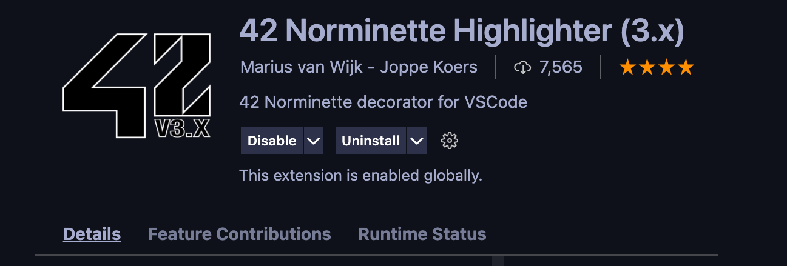
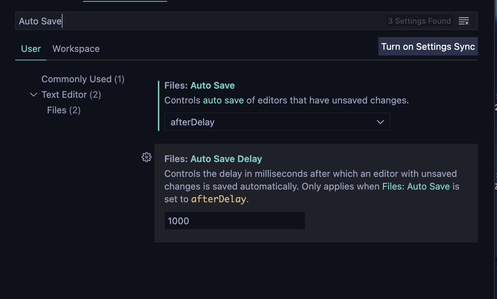
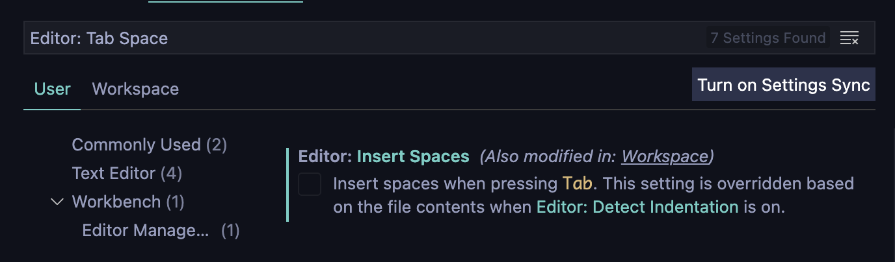
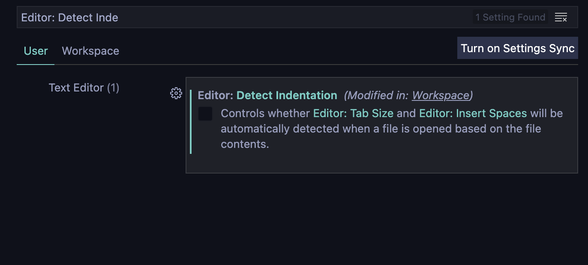
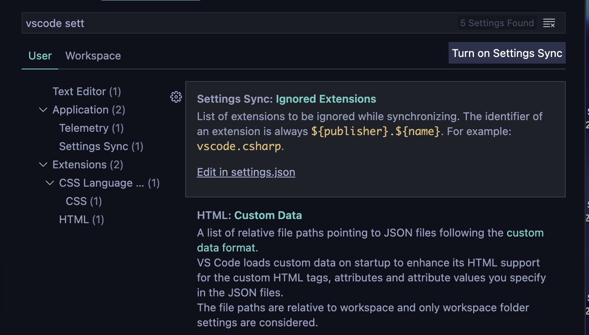
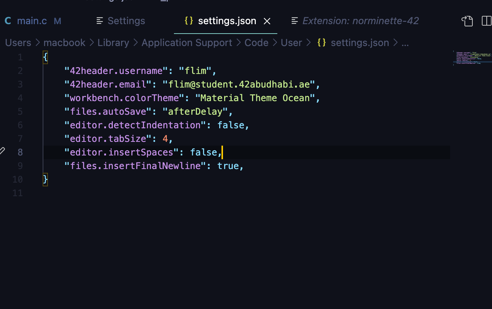

# Norminette Configuration in VS Code

## Download the following extensions

### 42 Header

This extension allows you to add a header on your file.  

### 42 Norminette Highlighter

This extension allows you to see the norminette errors in realtime.  

## VS Code configuration 

### Autosave file

It will save you time by saving it automatically every sec.  

### Disable Insertion of Space

Don't allow to add spaces when adding `tab` key.  

### Disable Detect Indentation

### Insert Newline on Last Line

Go to the settings of VS Code.  

Then, add `line 9`.

## Now, you're ready to go! Good luck on your journey in 42 ✌️
